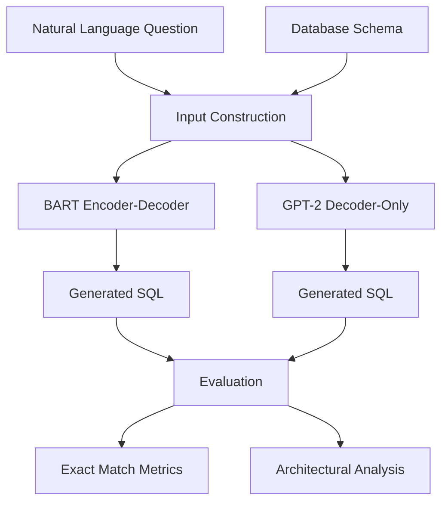

<div align="center">

</div>

---

# Neural Text-to-SQL Translation: A Comparative Analysis of Encoder-Decoder and Decoder-Only Architectures

This project investigates the Text-to-SQL task through a comparative study of two influential Transformer architectures: BART (Encoder–Decoder) and GPT-2 (Decoder-Only).

The goal is to transform natural language questions into executable SQL queries while leveraging database schema information. The project includes dataset preprocessing, model fine-tuning, SQL generation, exact-match evaluation, and an in-depth architectural comparison between sequence-to-sequence and autoregressive language models.

<div align="left">

[](https://www.python.org/)
[](https://huggingface.co/)
[](https://huggingface.co/facebook/bart-base)
[](https://huggingface.co/openai-community/gpt2)
[](https://pytorch.org/)
[](#)
[](#)
[](https://huggingface.co/datasets/gretelai/synthetic_text_to_sql)
[](https://opensource.org/licenses/MIT)

</div>

## Abstract

Text-to-SQL is a semantic parsing task that enables users to interact with relational databases using natural language. Given a natural language question and a database schema, the objective is to generate a syntactically correct and semantically accurate SQL query.

This project fine-tunes BART and GPT-2 on the Gretel Synthetic Text-to-SQL dataset and evaluates their ability to generate SQL statements from natural language inputs. The study focuses on schema-aware modeling, SQL normalization, Exact Match evaluation, and architectural differences between Encoder–Decoder and Decoder-Only Transformer models.

---

## Table of Contents

1. [Overview](#-overview)
2. [System Architecture](#-system-architecture)
3. [Dataset](#-dataset)
4. [Model Training](#-model-training)
5. [Evaluation Metrics](#-evaluation-metrics)
6. [Architectural Comparison](#-architectural-comparison)
7. [Transformer Formulation](#-transformer-formulation)
8. [Technologies](#-technologies)
9. [Project Structure](#-project-structure)
10. [Installation](#-installation)
11. [License](#license)
12. [Author](#author)
13. [Support](#-support)

---

# Overview

The project provides a complete Text-to-SQL pipeline including:

* Dataset loading and preprocessing
* Schema-aware input construction
* Fine-tuning BART for sequence-to-sequence SQL generation
* Fine-tuning GPT-2 using prefix-based SQL generation
* SQL normalization
* Exact Match evaluation
* Error analysis
* Comparative architectural study

The primary objective is to understand how Transformer architecture influences SQL generation quality.

---

# System Architecture



---

# Dataset

The experiments are conducted on the Gretel Synthetic Text-to-SQL dataset.

Dataset characteristics include:

* More than 105,000 Text-to-SQL examples
* 100 different domains
* Multiple SQL complexity levels
* Schema-aware database context
* Natural language questions paired with SQL queries
* Analytics, reporting, retrieval, and manipulation tasks

The dataset provides a realistic benchmark for evaluating Text-to-SQL systems across diverse database schemas and SQL structures.

---

# Model Training

## BART (Encoder–Decoder)

BART receives the question and schema as structured input and generates SQL using a sequence-to-sequence learning objective.

Advantages:

* Better schema understanding
* Strong conditional generation
* Effective handling of structured inputs

BART is based on a denoising sequence-to-sequence pretraining strategy combining bidirectional encoding and autoregressive decoding. 
The model is trained by maximizing the conditional likelihood of the target SQL sequence:

$$
P(Y \mid X)=\prod_{t=1}^{T} P(y_t \mid y_{\lt t}, X)
$$

where:

* $X$ denotes the input question and schema.
* $Y$ represents the target SQL query.
* $y_t$ is the token generated at step $t$.

---

## GPT-2 (Decoder-Only)

GPT-2 is trained using a prefix-based format:

```text
Question: ...
Schema: ...
SQL:
```

The model autoregressively generates the SQL query after observing the prompt.

GPT-2 models the probability of a SQL sequence using causal language modeling:

$$
P(Y)=\prod_{t=1}^{T} P(y_t \mid y_{\lt t})
$$

where each token is predicted based only on previously generated tokens.

Advantages:

* Simpler architecture
* Efficient generation
* Strong language modeling capabilities

---

# Evaluation Metrics

Model performance is evaluated using Exact Match (EM).

### Raw Exact Match

A prediction is considered correct only if the generated SQL query exactly matches the reference query:

$$
EM=\frac{1}{N}\sum_{i=1}^{N}\mathbb{I}(\hat{y}_i=y_i)
$$

where:

* $N$ is the number of samples.
* $y_i$ is the ground-truth SQL query.
* $\hat{y}_i$ is the generated SQL query.

---

### Cross-Entropy Training Loss

Both BART and GPT-2 are optimized using token-level cross-entropy loss:

$$
\mathcal{L}=-\sum_{t=1}^{T}\log P(y_t \mid y_{\lt t},X)
$$

Lower loss values indicate better alignment between generated SQL tokens and the ground-truth query.

---

### Normalized Exact Match

To reduce sensitivity to formatting differences, SQL queries are normalized before evaluation. This metric measures semantic agreement after standardizing whitespace, capitalization, and formatting variations.

---

# Architectural Comparison

The project compares BART and GPT-2 across:

| Criterion              | BART            | GPT-2        |
| ---------------------- | --------------- | ------------ |
| Architecture           | Encoder–Decoder | Decoder-Only |
| Schema Utilization     | Strong          | Moderate     |
| Conditional Generation | Excellent       | Good         |
| Structured Prediction  | Strong          | Moderate     |
| SQL Consistency        | Higher          | Lower        |
| Training Complexity    | Higher          | Lower        |

The comparison highlights how architectural design influences schema grounding, SQL correctness, and generation robustness in Text-to-SQL tasks.

---

# Technologies

| Component                 | Purpose                        |
| ------------------------- | ------------------------------ |
| PyTorch                   | Deep Learning                  |
| Hugging Face Transformers | Model Training                 |
| BART                      | Encoder–Decoder SQL Generation |
| GPT-2                     | Decoder-Only SQL Generation    |
| Datasets                  | Data Loading                   |
| SQLParse                  | SQL Normalization              |
| Scikit-Learn              | Data Splitting                 |
| Pandas                    | Data Processing                |

---

# 📁 Project Structure

```text
Text-to-SQL-Generation-with-BART-and-GPT2
│
├── bart_gpt2_text2sql.ipynb
│
├── data_preprocessing
│
├── BART_training
│
├── GPT2_training
│
├── evaluation
│
└── README.md
```

---

# 🚀 Installation

## Clone Repository

```bash
git clone https://github.com/farzadjannati/Text-to-SQL-Generation-with-BART-and-GPT2.git

cd Text-to-SQL-Generation-with-BART-and-GPT2
```

## Create Environment

```bash
conda create -n text2sql python=3.10

conda activate text2sql
```

## Install Dependencies

```bash
pip install -r requirements.txt
```

---

# License

This project is licensed under the MIT License.

---

## Author

**Farzad Jannati**

M.Sc. Student, University of Tehran

Research Assistant @ Social Networks Lab

**Research Interests:** NLP, Large Language Models (LLMs), Agentic AI, Retrieval-Augmented Generation (RAG), Information Retrieval

📧 [farzadjannati@ut.ac.ir](mailto:farzadjannati@ut.ac.ir) | 💻 [github.com/farzadjannati](https://github.com/farzadjannati) | 💼 [linkedin.com/in/farzadjannati](https://www.linkedin.com/in/farzadjannati)


---

# ⭐ Support

If you find this project useful, consider giving it a star ⭐


<p align="center">
Built with ❤️ using PyTorch, Transformers
</p>
