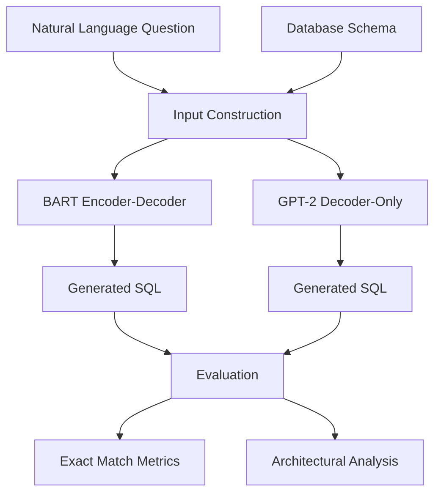

<div align="center">

</div>

---

# Text-to-SQL Generation with BART and GPT-2: A Comparative Study of Encoder–Decoder and Decoder-Only Transformers

This project investigates the Text-to-SQL task through a comparative study of two influential Transformer architectures: BART (Encoder–Decoder) and GPT-2 (Decoder-Only).

The goal is to transform natural language questions into executable SQL queries while leveraging database schema information. The project includes dataset preprocessing, model fine-tuning, SQL generation, exact-match evaluation, and an in-depth architectural comparison between sequence-to-sequence and autoregressive language models.

<div align="left">

[](https://www.python.org/)
[](https://huggingface.co/)
[](https://huggingface.co/facebook/bart-base)
[](https://huggingface.co/openai-community/gpt2)
[](https://pytorch.org/)
[](#)
[](#)
[](https://huggingface.co/datasets/gretelai/synthetic_text_to_sql)
[](https://opensource.org/licenses/MIT)

</div>

## Abstract

Text-to-SQL is a semantic parsing task that enables users to interact with relational databases using natural language. Given a natural language question and a database schema, the objective is to generate a syntactically correct and semantically accurate SQL query.

This project fine-tunes BART and GPT-2 on the Gretel Synthetic Text-to-SQL dataset and evaluates their ability to generate SQL statements from natural language inputs. The study focuses on schema-aware modeling, SQL normalization, Exact Match evaluation, and architectural differences between Encoder–Decoder and Decoder-Only Transformer models.

---

## Table of Contents

1. Overview
2. Key Features
3. System Architecture
4. Dataset
5. Model Training
6. Evaluation Metrics
7. Architectural Comparison
8. Technologies
9. Project Structure
10. Installation
11. Results
12. License
13. Author

---

# 📌 Overview

The project provides a complete Text-to-SQL pipeline including:

* Dataset loading and preprocessing
* Schema-aware input construction
* Fine-tuning BART for sequence-to-sequence SQL generation
* Fine-tuning GPT-2 using prefix-based SQL generation
* SQL normalization
* Exact Match evaluation
* Error analysis
* Comparative architectural study

The primary objective is to understand how Transformer architecture influences SQL generation quality.

---

# 🎯 Key Features

* End-to-End Text-to-SQL Pipeline
* BART Fine-Tuning
* GPT-2 Fine-Tuning
* Schema-Aware Prompt Engineering
* SQL Query Generation
* SQL Normalization
* Exact Match Evaluation
* Encoder–Decoder vs Decoder-Only Analysis
* Error Analysis and Benchmarking
* Reproducible Research Workflow

---

# System Architecture



---

# 📚 Dataset

The experiments are conducted on the Gretel Synthetic Text-to-SQL dataset.

Dataset characteristics include:

* More than 105,000 Text-to-SQL examples
* 100 different domains
* Multiple SQL complexity levels
* Schema-aware database context
* Natural language questions paired with SQL queries
* Analytics, reporting, retrieval, and manipulation tasks

The dataset provides a realistic benchmark for evaluating Text-to-SQL systems across diverse database schemas and SQL structures.

---

# 🤖 Model Training

## BART (Encoder–Decoder)

BART receives the question and schema as structured input and generates SQL using a sequence-to-sequence learning objective.

Advantages:

* Better schema understanding
* Strong conditional generation
* Effective handling of structured inputs

BART is based on a denoising sequence-to-sequence pretraining strategy combining bidirectional encoding and autoregressive decoding.

---

## GPT-2 (Decoder-Only)

GPT-2 is trained using a prefix-based format:

```text
Question: ...
Schema: ...
SQL:
```

The model autoregressively generates the SQL query after observing the prompt.

Advantages:

* Simpler architecture
* Efficient generation
* Strong language modeling capabilities

---

# 📏 Evaluation Metrics

Model performance is evaluated using:

### Raw Exact Match (EM)

Measures exact string equality between generated and reference SQL queries.

### Normalized Exact Match

Evaluates SQL after normalization and formatting to reduce sensitivity to superficial syntax differences.

---

# 🔬 Architectural Comparison

The project compares BART and GPT-2 across:

| Criterion              | BART            | GPT-2        |
| ---------------------- | --------------- | ------------ |
| Architecture           | Encoder–Decoder | Decoder-Only |
| Schema Utilization     | Strong          | Moderate     |
| Conditional Generation | Excellent       | Good         |
| Structured Prediction  | Strong          | Moderate     |
| SQL Consistency        | Higher          | Lower        |
| Training Complexity    | Higher          | Lower        |

The comparison highlights how architectural design influences schema grounding, SQL correctness, and generation robustness in Text-to-SQL tasks.

---

# 🛠 Technologies

| Component                 | Purpose                        |
| ------------------------- | ------------------------------ |
| PyTorch                   | Deep Learning                  |
| Hugging Face Transformers | Model Training                 |
| BART                      | Encoder–Decoder SQL Generation |
| GPT-2                     | Decoder-Only SQL Generation    |
| Datasets                  | Data Loading                   |
| SQLParse                  | SQL Normalization              |
| Scikit-Learn              | Data Splitting                 |
| Pandas                    | Data Processing                |

---

# 📁 Project Structure

```text
Text-to-SQL-Generation-with-BART-and-GPT2
│
├── bart_gpt2_text2sql.ipynb
│
├── data_preprocessing
│
├── BART_training
│
├── GPT2_training
│
├── evaluation
│
└── README.md
```

---

# 🚀 Installation

## Clone Repository

```bash
git clone https://github.com/farzadjannati/Text-to-SQL-Generation-with-BART-and-GPT2.git

cd Text-to-SQL-Generation-with-BART-and-GPT2
```

## Create Environment

```bash
conda create -n text2sql python=3.10

conda activate text2sql
```

## Install Dependencies

```bash
pip install -r requirements.txt
```

---

# 📊 Expected Outcomes

The project demonstrates:

* Practical Text-to-SQL generation
* Schema-aware SQL synthesis
* Comparison of Transformer architectures
* Impact of Encoder–Decoder modeling on structured generation
* Evaluation of SQL generation quality using Exact Match metrics

---

# License

This project is licensed under the MIT License.

---

## Author

**Farzad Jannati**

M.Sc. Student, University of Tehran

Research Interests:

* Natural Language Processing
* Large Language Models
* Text-to-SQL Systems
* Information Retrieval
* Agentic AI
* Retrieval-Augmented Generation

---

# ⭐ Support

If you find this project useful, consider giving it a star ⭐

---

<p align="center">
Built with ❤️ using PyTorch, Transformers
</p>
